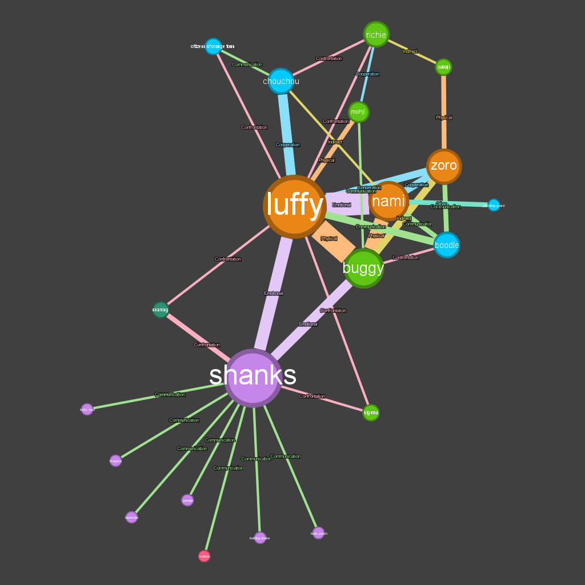

# Visualización de relaciones y su tipo de los personajes de la obra 'One Piece' durante arco 'Orange Town'

## Force-Directed Graph for One Piece Characters

    
    

Se puede ver un gráfico de tipo network, concretamente un force-directed-graph, en el que los nodos tienen fuerza y gravedad y se recolocan en función de las interacciones.

    

        Fuente: Datos obtenidos de One Piece Wiki: <a, href=https://onepiece.fandom.com/wiki/One_Piece_Wiki,target="_blank" style="color: #007bff;"> One Piece Wiki</a>
    

